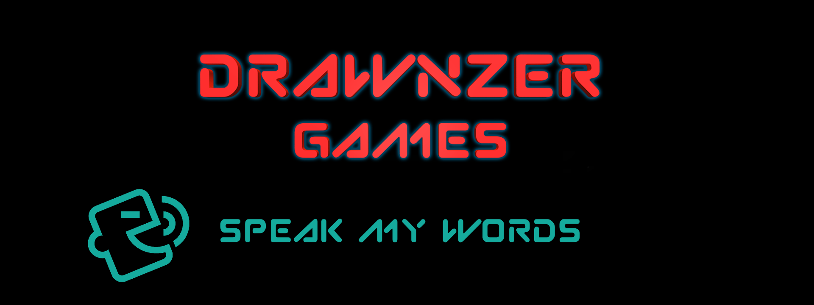
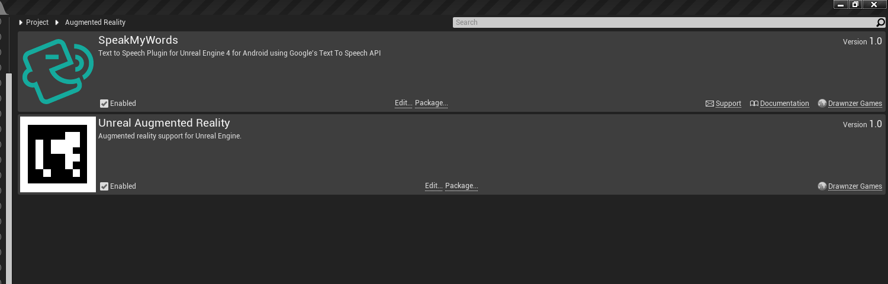
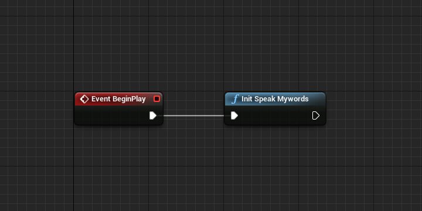
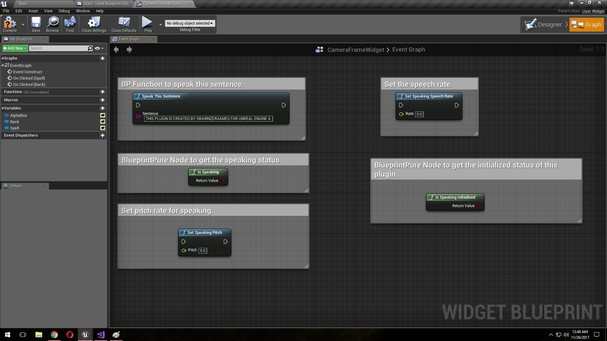

# Speak My Words
The **Speak My Words** plugin lets you integrate out-of-the-box [Text To Speech API](https://developer.android.com/reference/android/speech/tts/TextToSpeech.html) for Android into your [Unreal Engine 4](http://www.unrealengine.com) project.

* **Current version:** 1.0
* **Binaries compiled for:** Unreal Engine 4.18.1
* **Required Unreal Engine 4.18 or above.**

## Features
* This smart plugin will speak whatever you want to speak.
* Set the speech rate for whatever you want to speak.
* Set the pitch for whatever you want to speak.
* Works with dev & shipping builds.
* Out-of-the-box Android.
* Additional SDK included.
* Works with Blueprint-only & source code projects.
* Works with Launcher & GitHub UE4 versions.

## Setup

Copy this folder to the *Plugins* folder located in the main path of your project.
Enable *Speak My Words* in *Edit -> Plugins -> Augmented Reality -> Speak My Words*.

## Easy To Use Blueprint Functions

* First Initialize the Speak My Words, recommended time to initialize is at the start of your level.

* Then use these simple Blueprint functions from anywhere to speak, set pitch and speech rate at any moment in your game.

